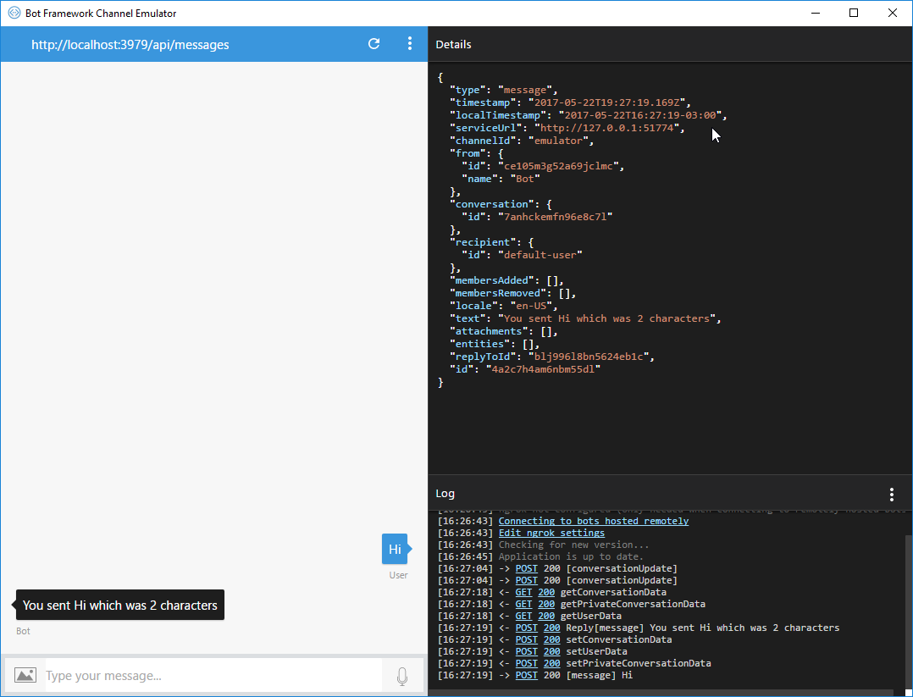

# Exercise 1: Creating Your First "Echo" Bot with the Bot Builder SDK for Node.js

## Introduction

This exercise will show you how to build a bot by using the Bot Builder SDK for Node.js and then test it with the Bot Framework Emulator.

Inside [this folder](./exercise1-EchoBot) you will find a solution with the code that results from completing the steps in this exercise. You can use this solutions as guidance if you need additional help as you work through this exercise. Remember that before using it, you first need to run `npm install`.

## Prerequisites

The following software is required for completing this exercise:

* [Latest Node.js with NPM](https://nodejs.org/en/download)
* A code editor like [Visual Studio Code](https://code.visualstudio.com/download) (preferred) or Visual Studio 2017 Community or higher
* [Bot Framework Emulator](https://emulator.botframework.com), which is the client you will use for testing your bot

## Task 1: Initialize the App and Install the Bot Builder SDK

The Bot Builder SDK for Node.js is a powerful, easy-to-use framework that provides a familiar way for Node.js developers to write bots. It leverages frameworks like Express & Restify to provide a familiar way for JavaScript developers to write bots.

1. To install the Bot Builder SDK and its dependencies, first create a folder for your bot. Open a console window, navigate to it, and run the following npm command. Use `bot.js` as your entry point, and leave the rest of the default answers.

    ```
    npm init
    ```

1. Next, install the [Bot Builder SDK](https://dev.botframework.com), [Restify](http://restify.com/) and [Dotenv](https://github.com/motdotla/dotenv) modules by running the following  commands:

   ``` 
    npm install -g yo
    npm install -g generator-botbuilder
    ```
Then, use the generator to create an echo bot.

```
    yo botbuilder
```

Yeoman prompts you for some information with which to create your bot.

* Enter a name for your bot.
* Enter a description.
* Choose the language for your bot, either JavaScript or TypeScript.
* Choose the Echo template.

Bot Builder, part of Bot Framework, is used to create the bot, while Restify is used to serve the web application which will host your bot. Thanks to the template, your project contains all of the code that's necessary to create the bot in this quickstart. You won't actually need to write any additional code.

## Task 2: Create the Bot

Open an elevated command prompt, create a directory, and initialize the package for your bot.
    
```
    md myBots
    cd myBots
```

Next, install Yeoman and the generator for JavaScript
    
``` 
    npm install -g yo
    npm install -g generator-botbuilder
```
Then, use the generator to create an echo bot.
```
    yo botbuilder
```

Yeoman prompts you for some information with which to create your bot.

* Enter a name for your bot.
* Enter a description.
* Choose the language for your bot, either JavaScript or TypeScript.
* Choose the Echo template.

  

Thanks to the template, your project contains all of the code that's necessary to create the bot in this quickstart. You won't actually need to write any additional code.


## Task 2: Start & Test the Bot

Next, test your bot by using the Bot Framework Emulator to see it in action. The emulator is a desktop application that lets you test and debug your bot on localhost or running remotely through a tunnel. The emulator displays messages as they would appear in a web chat UI and logs JSON requests and responses as you exchange messages with your bot.

# Testing the bot using Bot Framework Emulator
1. Click the Open Bot link in the emulator "Welcome" tab.
2. Select the .bot file located in the directory where you created the project.
3. Send a message to your bot, and the bot will respond back with a message. 


Send a message to your bot, and the bot will respond back with a message. 


# Or To run the bot manually
You can also run it manually and then input the details in the emulator to run your bot.
1. Start your bot in a console window by using the following command. At this point, your bot is running locally.

   - Install modules and start the bot

        ```bash
        npm i & npm start
        ```

    Alternatively you can also use nodemon via

``` bash
npm i & npm run watch
```

> **NOTE:** If you get a Windows Firewall alert, click **Allow access**. Also, if you get an `EADDRINUSE` error, change the default port to 3979 or similar.


2. Next, start the Bot Framework Emulator, and then create a new bot configuration. Type your Bot name and End point url `http://localhost:3978/api/messages` into the address bar. This is the default endpoint that your bot listens to when hosted locally.
    > **NOTE:** You may need to add the /api/messages in the URL 

1. click **Save and Connect**. Because you are running your bot locally, you won't need to specify **Microsoft App ID** and **Microsoft App Password**. You can leave these fields blank for now. You'll get this information in Exercise 5 when you register your bot in the Bot Framework Portal.

1. You should see that the bot responds to each message you send by echoing back your message prefixed with the text "You said" and ending in the text 

    
    
# Further reading- Bot state

A key to good bot design is to track the context of a conversation, so that your bot remembers things like the answers to previous questions. Depending on what your bot is used for, you may even need to keep track of conversation state or store user related information for longer than the lifetime of one given conversation.

  

In this example, the bot's state is used to track number of messages.

  

A bot's state is information it remembers in order to respond appropriately to incoming messages. The Bot Builder SDK provides classes for [storing and retrieving state data][4] as an object associated with a user or a conversation.

  

- Conversation properties help your bot keep track of the current conversation the bot is having with the user. If your bot needs to complete a sequence of steps or switch between conversation topics, you can use conversation properties to manage steps in a sequence or track the current topic. Since conversation properties reflect the state of the current conversation, you typically clear them at the end of a session, when the bot receives an end of conversation activity.

  

- User properties can be used for many purposes, such as determining where the user's prior conversation left off or simply greeting a returning user by name. If you store a user's preferences, you can use that information to customize the conversation the next time you chat. For example, you might alert the user to a news article about a topic that interests her, or alert a user when an appointment becomes available. You should clear them if the bot receives a delete user data activity.
    
    
