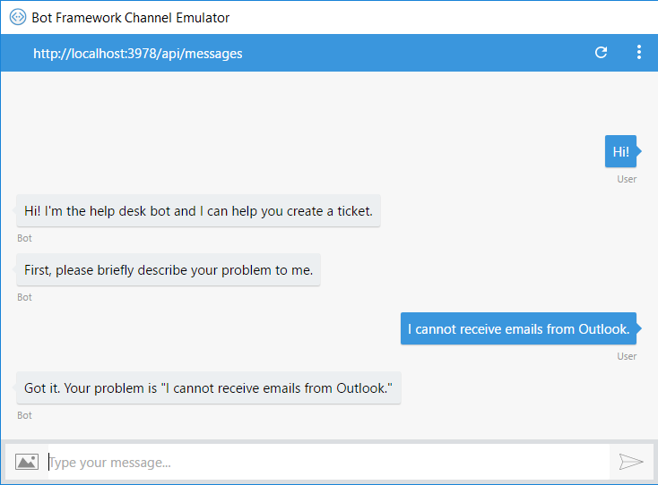
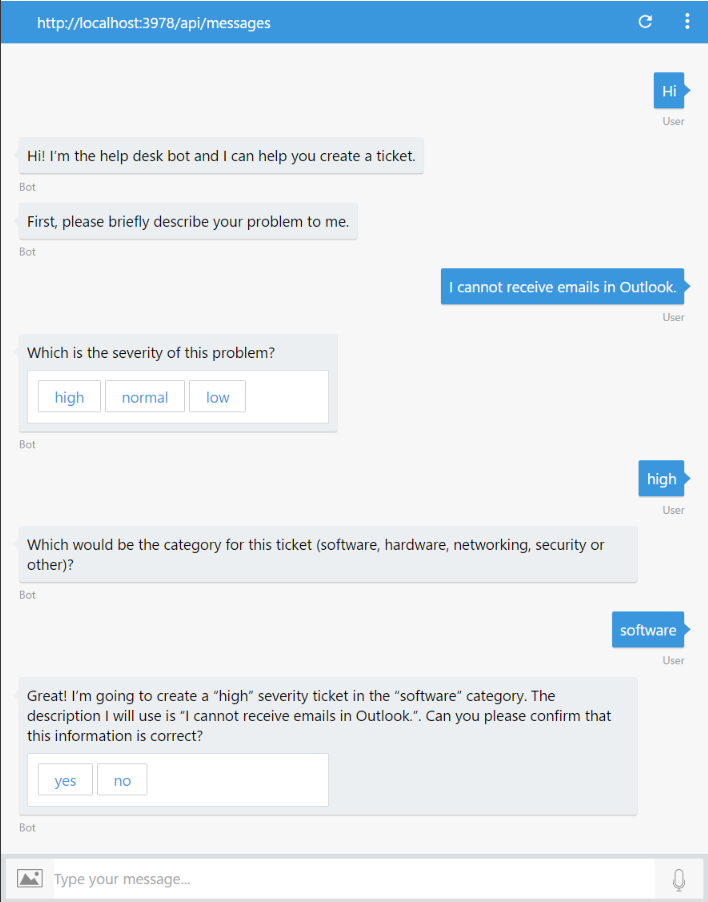

# Exercise 2: Submitting Help Desk Tickets with the Bot (Node.js)

## Introduction

In this exercise you will learn how to add conversation abilities to the bot to guide the user to create a help desk ticket.

Inside [this folder](./exercise2-TicketSubmissionDialog) you will find a solution with the code that results from completing the steps in this exercise. You can use this solutions as guidance if you need additional help as you work through this exercise. Remember that for using it, you first need to run `npm install`.

## Prerequisites

The following software is required for completing this exercise:

* [Latest Node.js with NPM](https://nodejs.org/en/download)
* A code editor like [Visual Studio Code](https://code.visualstudio.com/download) (preferred) or Visual Studio 2017 Community or higher
* The [Bot Framework Emulator](https://emulator.botframework.com) (make sure it's configured with the `en-US` Locale)

## Lab Notes

One thing you may notice is `bot.js` becomes a bit long, with a mix of all. This is done to make working through the lab easier. In more complex bots, you would typically break your bot across several files.

## Task 1: Adding Conversation to the Bot

In this task you will modify the bot to ask the user a sequence of questions before performing some action.

1. Open the `bot.js` file you've obtained from the previous exercise. Alternatively, you can open the file from the [exercise1-EchoBot](./exercise1-EchoBot) folder.

1. A conversation between a bot and a user often involves asking (prompting) the user for information, parsing the user's response, and then acting on that information. The Bot Builder SDK provides a dialogs library that provides methods designed to make it easier to ask questions, and to make sure the response matches a specific data type or meets custom validation rules. To prompt a user for input, define a prompt using one of the built-in classes like TextPrompt, then add it to your dialog set and assign it a dialog ID. To understand more about prompt and dialogs, please read the reference
     >https://docs.microsoft.com/en-us/azure/bot-service/bot-builder-prompts?view=azure-bot-service-4.0&tabs=javascript
 
2. Using dialogs to guide the user through steps, We would be using a waterfall dialog to get the user inputs. When a user sends a message to our bot, the first function in the waterfall will be called. This will greet the user and use the `text()` prompt  to describe the problem first. The SDK provides a set of built-in prompts to simplify collecting input from a user.

    The user's response will be passed to the second function in the waterfall which will confirm the description. This cascading sequence of questions and responses is what gives the waterfall feature its name.

    Also, the response is persisted in dialog converstation data properties, which is used to persist information for a  dialog instance.  The Bot Builder SDK provides two classes for storing and retrieving state data as an object associated with a user or a conversation.
    *   Conversation state help your bot keep track of the current conversation the bot is having with the user
    *   User state can be used for many purposes, such as determining where the user's prior conversation left off or simply greeting a returning user by name
    
    The ConversationState and UserState are state classes that are specializations of BotState class with policies that control the lifetime and scope of the objects stored in them.

    ``` javascript index,js
    index.js
    const { BotFrameworkAdapter, MemoryStorage, ConversationState } = require('botbuilder');
    
     // Create a dialog that asks the user for the problem, severity & category.
    this.dialogs.add(new WaterfallDialog(ISSUE_TICKET, [
      this.askForIssue.bind(this),
      this.askForSeverity.bind(this),
      this.askForcategory.bind(this),
      this.collectAndDisplayTicket.bind(this)
     ]));
    ```

1. Run the app from a console (`npm i & npm start`) and open the emulator. Type the bot URL as usual (`http://localhost:3978/api/messages`) or open the bot file directly and test the bot.

    

## Task 2: Prompting for the Tickets Details

In this task you are going to add more message handlers to the bot waterfall to prompt for all the ticket details.

1. Update the code in the bot.js file with the following. It introduces these types of prompts:

    * `Text Prompt`: To prompt for the severity of the ticket.
    * `Confirm Prompt`: To confirm that the ticket information is correct.
    * `Choice Prompt` : To confirm the choice in "yes/no" 

    ```javascript
    this.dialogs.add(new TextPrompt(PROBLEM_DESC_PROMPT));
    this.dialogs.add(new ChoicePrompt(SEVERITY_CHOICEPROMPT));
    this.dialogs.add(new TextPrompt(CATEGORY_PROMPT));
    this.dialogs.add(new ConfirmPrompt(TICKET_CONFIRMPROMPT));
    
    this.dialogs.add(new WaterfallDialog(ISSUE_TICKET, [
    this.askForIssue.bind(this),
    this.askForSeverity.bind(this),
    this.askForcategory.bind(this),
    this.collectAndDisplayTicket.bind(this)
    ]));
     
    async askForIssue(step) {
    await step.context.sendActivity('Hi! I\'m the help desk bot and I can help you create a ticket.');
    return await step.prompt(PROBLEM_DESC_PROMPT, 'First, please briefly describe your problem to me.');
    }

    async askForSeverity(step) {
        await this.ticketDesc.set(step.context, step.result);
        var choices = ['high', 'normal', 'low'];
        await step.prompt(SEVERITY_CHOICEPROMPT, 'What is severity?', choices);
      }

    async askForcategory(step) {
        await this.ticketSeverity.set(step.context, step.result.value)
        return await step.prompt(CATEGORY_PROMPT, 'Which would be the category for this ticket (software, hardware, networking, security or other)?');
      }
    
    async collectAndDisplayTicket(step) {
        await this.ticketCategory.set(step.context, step.result);
        const desc = await this.ticketDesc.get(step.context, null);
        const severity = await this.ticketSeverity.get(step.context, null);
    var message = `Great! I'm going to create a "${desc}" severity ticket in the "${severity}" category. ` +
          `The description I will use is "${step.result}". Can you please confirm that this information is correct?`;
        return await step.prompt(TICKET_CONFIRMPROMPT, message);
      }
    ```

    > **NOTE:** You can also use async functions inside the waterfall dialog.

1. Re-run the app and use the 'Start Over' button of the emulator . Test the new conversation.

    

    At this point if you talk to the bot again, the waterfall will start over.

## Task 3:TODO: Calling an External API to Save the Ticket

At this point you have all the information for the ticket, however that information is discarded when the waterfall ends. You will now add the code to create the ticket using an external API. For simplicity purposes, you will use a simple endpoint that saves the ticket into an in-memory array. In the real world, you can use any API that is accessible from your bot's code.

> **NOTE:** One important fact about bots to keep in mind is most bots you will build will be a front end to an existing API. Bots are simply apps, and they do not require artificial intelligence (AI), machine learning (ML), or natural language processing (NLP), to be considered a bot.

 
 
 ## ** Please use the steps given in [V3 Node](./Node/exercise2-TicketSubmissionDialog.md) to read more about it. 

## Further Challenges

If you want to continue working on your own you can try with these tasks:

* Send a welcome message to the bot relying on the `conversationUpdate` event, as explained [here](https://docs.microsoft.com/en-us/azure/bot-service/bot-builder-send-welcome-message?view=azure-bot-service-4.0&tabs=csharp%2Ccsharpmulti%2Ccsharpwelcomeback).
* Understand more about the dialogs and state, please read [here]https://docs.microsoft.com/en-us/azure/bot-service/bot-builder-concept-dialog?view=azure-bot-service-4.0).
