# Exercise 3: Making the Bot Smarter with Language Understanding (Node.js)

## Introduction

One of the key problems in human-computer interactions is the ability of the computer to understand what a person wants. LUIS is designed to enable developers to build smart applications that can understand human language and react to user requests.

In this exercise you will learn how to add natural language understanding abilities to the help desk bot to make it easier for users to create a ticket. To do this, you will use LUIS (Language Understanding Intelligent Service), part of Azure Cognitive Services, which allow developers to build language models to allow a bot to understand commands and act accordingly. For instance, while in the previous exercise the user had to enter the severity and category, in this one, both "entities" will try to be recognized from the user message.

Inside [this folder](./exercise3-LuisDialog) you will find a solution with the code that results from completing the steps in this exercise. You can use this solutions as guidance if you need additional help as you work through this exercise. Remember that for using it, you first need to run `npm install` and complete the values of the LUIS Model in the `.bot` file.

## Prerequisites

The following software is required for completing this exercise:

* [Latest Node.js with NPM](https://nodejs.org/en/download)
* A code editor like [Visual Studio Code](https://code.visualstudio.com/download) (preferred), or Visual Studio 2017 Community or higher
* An [Azure](https://azureinfo.microsoft.com/us-freetrial.html?cr_cc=200744395&wt.mc_id=usdx_evan_events_reg_dev_0_iottour_0_0) Subscription
* The [Bot Framework Emulator](https://emulator.botframework.com) 
* An account in the [LUIS Portal](https://www.luis.ai)

## Task 1: Create the LUIS App

In this task you will create an app in the LUIS portal.

> **NOTE:** If you are already familiar with LUIS, you can import the file `luis_model.json` located under the [assets](../assets/exercise3-LuisDialog) folder of this exercise into your account, train and publish the model and continue on task 4. However, if you are new to LUIS, we recommend you work through creating the model from scratch for learning purposes.

1. Navigate to the [LUIS Portal](https://www.luis.ai) and sign in. Open the **My apps** tab.

1. Click **New App**. In the dialog box, type an application **name** (for example _HelpDeskBot_). Select the _English_ **Culture**, if not already selected.

    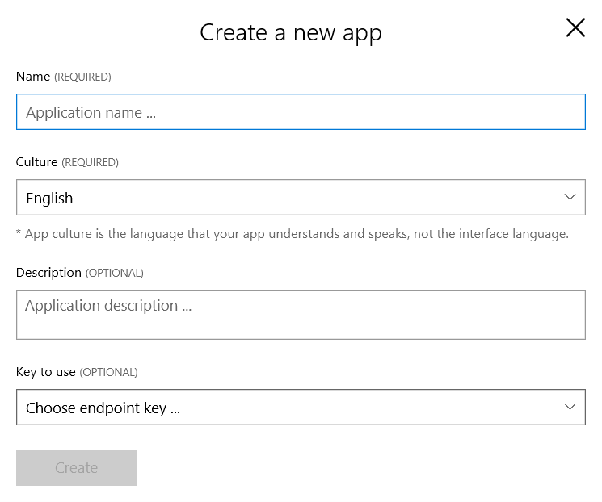

1. Choose a **Key to use**. If you don't select any, a _BoostrapKey_ will be created by default.

1. Click **Create**. You should see an empty LUIS app dashboard.

    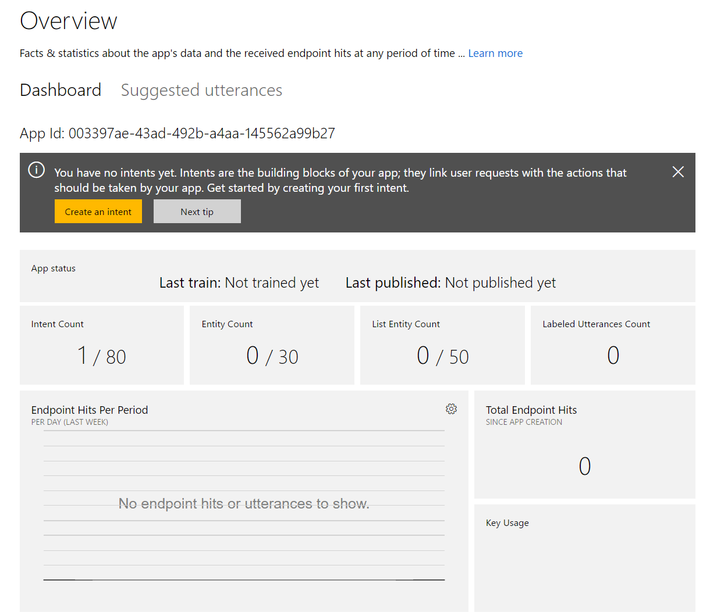

## Task 2: Add New Entities to LUIS

In this task you will add entities to the LUIS app. This will allow the bot to understand the ticket category and severity from the issue description entered by the user. Entities are 'nouns' in your application’s domain. An entity represents a class including a collection of similar objects (places, things, people, events or concepts).

For the purposes of this lab, you will be using the *List* entity type. This allows you to create what's commonly called a "closed list", meaning that **no machine learning** will be applied to the terms, but rather a direct match will be used. This is extremely useful when trying to normalize terms, or to ensure certain keywords are always picked up as entities.

1. In the LUIS portal, click **Entities** in the left panel.

1. Click **Add custom entity**.

1. In the dialog that opens, type _category_ as the **Entity name**. Select _List_ as the **Entity type**. Click **Save**.

    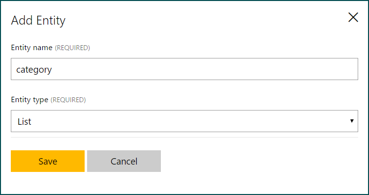

1. A new page is displayed in which you can add the possible values. To make this process faster, click the **Import Lists** link.

1. Browse for the `categories.json` file in the [assets](../assets) folder on the root of this hands-on lab. Once enabled click the **Import** button.

1. Repeat this process with a new entity named **severity** and populate it using the file named `severities.json` from the same location.

    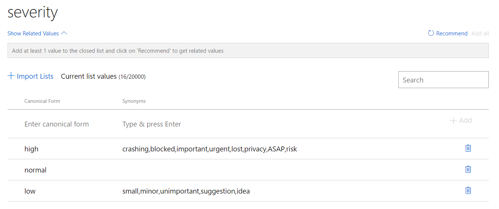

1. Now click on **Train & Test** in the left panel.

1. Click **Train Application** and wait a few seconds to complete. Whenever you make updates in your current model, you’ll need to train your app before testing and publishing it.

## Task 3: Add Intents and Utterances

Intents are the intentions or desired actions conveyed through the utterances (sentences). Intents match user requests with the actions that should be taken by your bot. So, you must add intents to help your bot understand user requests and react to them properly. If entities are the nouns, the intent is the verb.

Utterances are sentences representing examples of user queries or commands that your bot is expected to receive and interpret. You need to add example utterances for each intent in your bot. LUIS learns from these utterances and your bot is able to generalize and understand similar contexts. By constantly adding more utterances and labeling them, you are enhancing your bot's language learning experience.

You can read more information about intents [here](https://docs.microsoft.com/en-us/azure/cognitive-services/LUIS/add-intents) and utterances [here](https://docs.microsoft.com/en-us/azure/cognitive-services/LUIS/add-example-utterances).

1. In the LUIS portal, click **Intents** in the left panel. You will notice there is already a _None_ intent present.

1. Click on **Add Intent** and a popup is shown. Type _SubmitTicket_ as the **Intent name** and click **Save**.

1. Now, let's add the following utterances in the text box. Press enter after each one. When the user types these sentences or similar ones, the LUIS app will assume the user is trying to submit a ticket. In the Bot Framework language, this is called _Intent_.
    * _I can't log in, I'm blocked._
    * _I cannot print and I need to do it urgently._
    * _I need to request a new RAS token._
    * _I need to reset my password ASAP._
    * _I cannot open a web page and my deadline is at risk._

    > **NOTE:** You can add as many utterances as you want. More utterances you add, the better your app will recognize the intent of the users. In this particular case, the utterances that can trigger the SubmitTicket are quite diverse (ranging from hardware to software problems), so it would be ideal that the bot is trained with a considerable amount of utterances before releasing it to production.

1. Click **Save** ().

1. Following the same steps as above, add a new `Help` Intent with the utterances _help_, _hi_ and _hello_.

    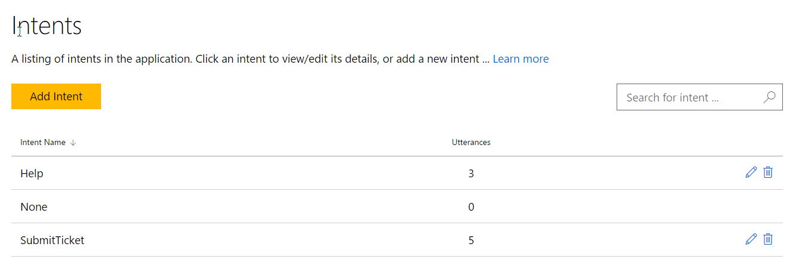

    > **NOTE:** It's a good practice to add some utterances to the "None" Intent, even if it is different from other intents. Giving it training examples won't limit what text will trigger the "None" intent, but it will help the other Intents fire more accurately.

1. Train the app again as explained previously.

1. Open the **Intents** menu and click on the **SubmitTicket** intent. Check that the utterances have been recognized with the entities values.

    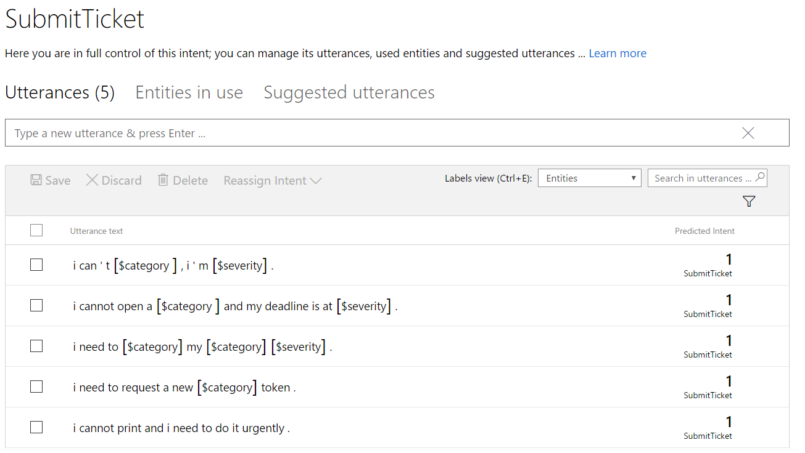

1. Now you will publish the LUIS app to be able to use it from the bot. Click **Publish App** from the left menu.

1. Make sure an _Endpoint key_ is selected. Leave the default _Production_ slot.

1. Click on the **Publish** button. After a new confirmation message appears, the LUIS's app is now published. Copy and save for later use the *Endpoint url* generated.

    Notice that the output of a LUIS app is a web service with an HTTP endpoint that you reference from your bot to add natural language understanding to it.

    > **NOTE:** The _BoostrapKey_ has 1,000 transactions per month.

## Task 4: Configure the Bot to Use LUIS

In this task you will update the bot code to use the LUIS app created previously.

1. Open the `bot.js` file you've obtained from the previous exercise. Alternatively, you can open the file from the [exercise2-TicketSubmissionDialog](./exercise2-TicketSubmissionDialog) folder.

1. Update the `.bot` file adding the following service, complete the _LUIS_MODEL_KEYS_ key with the value obtained from the previous task.

    ```javascript
     "type": "luis",
      "appId": "<Your APP ID>",
      "subscriptionKey": "<Your Subscription Key>",
      "region": "<Region>",
      "Version": "0.1",
      "endpoint": "<end point>",
      "name": "<LUIS Service Name>"
    ```

1. Add the LuisRecognizer into your bot by adding this line after the bot initialization.

    ```javascript
    const LUIS_CONFIGURATION = 'YOUR LUIS CONFIGURATION NAME';
    const luisConfig = botConfig.findServiceByNameOrId(LUIS_CONFIGURATION);
    ```

. Out of the box, the Bot Builder SDK comes with a LUISRecognizer class that can be used to call the machine learning model you’ve trained using the LUIS portal. 
 Please refer to this documentation
> https://github.com/Microsoft/botbuilder-js/tree/master/libraries/botbuilder-ai#use 


## Task 5: Update the Bot to use LUIS

Now you will refactor the waterfall steps from exercise 2 into new dialogs that will be triggered by the LUIS intents. Dialogs help you encapsulate your bot's conversational logic into manageable components. A dialog can be composed with other dialogs to maximize reuse, and a dialog Set context maintains the stack of dialogs that are active in the conversation at any point in time.

1. Call the luis application API's to recognize & retrieve the intent

    ```javascript
   // Perform a call to LUIS to retrieve results for the user's message.
   const results = await this.luisRecognizer.recognize(step.context);

   // Since the LuisRecognizer was configured to include the raw results, get the `topScoringIntent` as specified by LUIS.
   const topIntent = results.luisResult.topScoringIntent;

    ```


1. Now retrieve the entities values for *category* and *severity* from LUIS and store them in the Conversation properties for later use. Finally, if the severity is already saved, we call the next step, otherwise prompt the user to choose one. To do this, replace the first waterfall step with the following code.

    ```javascript
    ...
    // Get entity if available.
    const category = (CATEGORY_ENTITY in results.entities) ? results.entities[CATEGORY_ENTITY][0] : undefined;
    
    const severity = (SEVERITY_ENTITY in results.entities) ? results.entities[SEVERITY_ENTITY][0] : undefined;
    ...
    ```

1. Update the code receive and save the severity of the ticket. If the category is already understood the next step is called, otherwise the bot prompts the user to type it. 

1. Finally create a new Help dialog that will be executed when the user types _help_ or _hi_.

## Task 6: Test the Bot from the Emulator

1. Run the app from a console (`nodemon app.js`) and open the emulator. Type the bot URL as usual (`http://localhost:3978/api/messages`).

1. Type _hi_. Notice how the _Help_ intent is recognized and executed.

    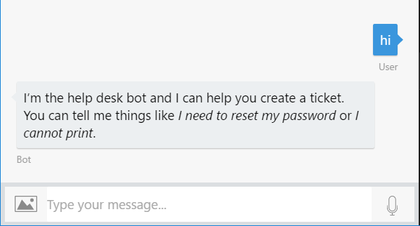

1. Type one of the utterances you used to train the bot. For example, _I can't log in, I'm blocked_. Notice that the ticket category and severity are automatically understood from the user message. Type _yes_ to save the ticket.

    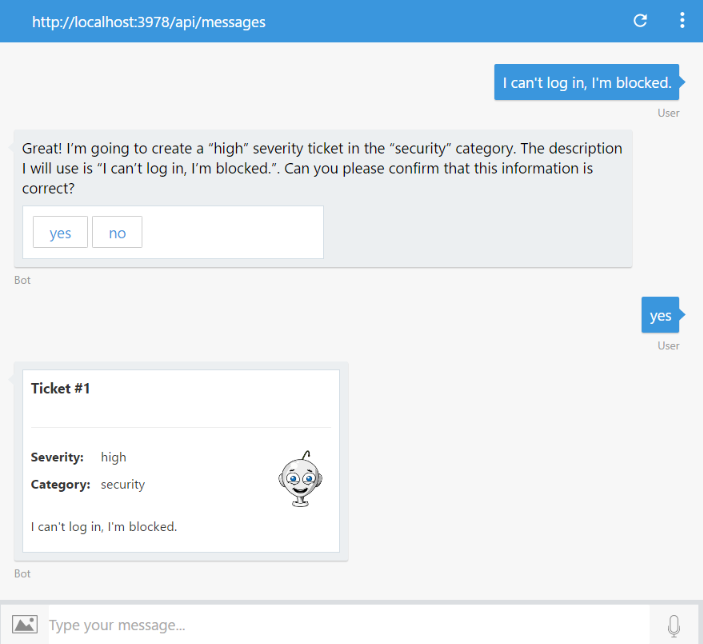

1. Now try typing something that the bot was not trained for. For example: _My computer is making a grinding noise_. Notice that the severity is not understood, but the category was because of the presence of the entity _computer_.

    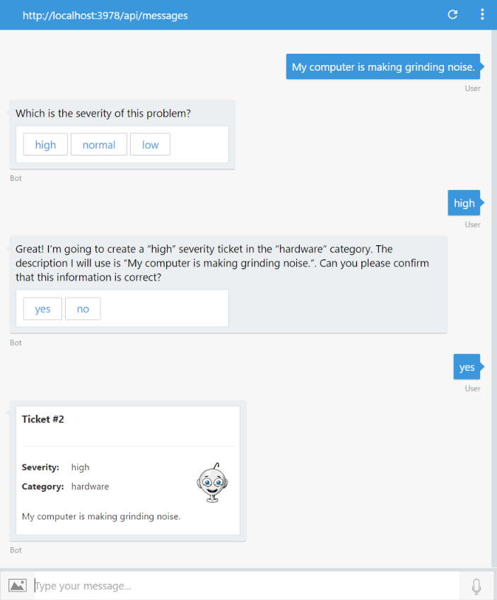

1. If you type something that the LUIS cannot recognize, LUIS will return the _None_ intent and the bot framework will execute the default dialog handler.

    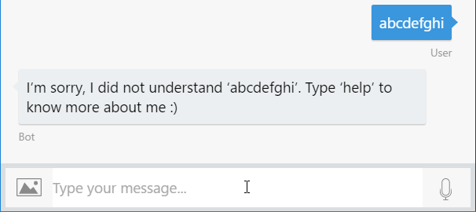

    Once your application is deployed and traffic starts to flow into the system, LUIS uses active learning to improve itself. In the active learning process, LUIS identifies the utterances that it is relatively unsure of, and asks you to label them according to intent and entities. In the LUIS portal, within an Intent, you will find the **Suggested Utterances** section, where you can do this.

    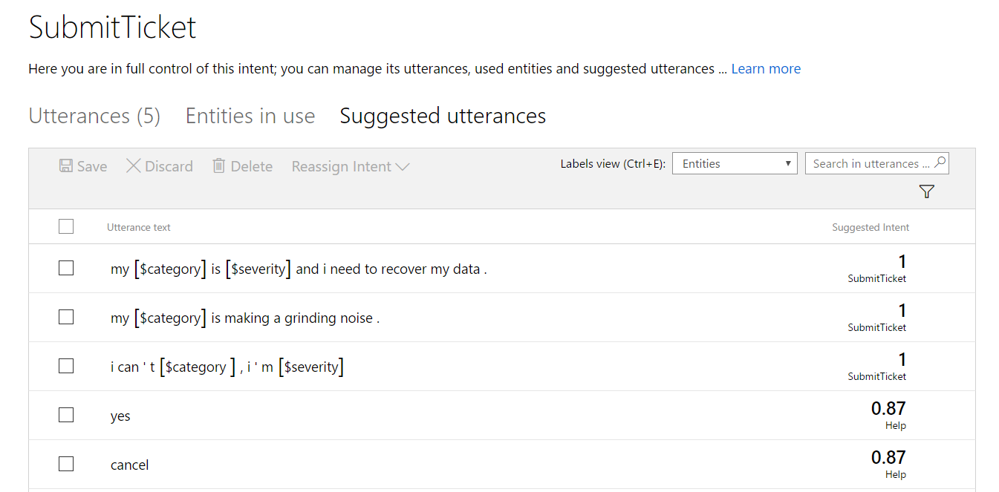

## Further Challenges

If you want to continue working on your own you can try with these tasks:

* Integrate multiple LUIS and QnA services with the Dispatch tool .[Link](https://docs.microsoft.com/en-us/azure/bot-service/bot-builder-tutorial-dispatch?view=azure-bot-service-4.0&tabs=javascript)
* Add the ability to the bot to ask for the status of a ticket. You would need to add a status property to the ticket and a new Intent in the LUIS app that invokes a new dialog.

## Additional Resources

* [Manage conversation and user state](https://docs.microsoft.com/en-us/azure/bot-service/bot-builder-howto-v4-state?view=azure-bot-service-4.0&tabs=js)
* [Managing conversations and dialogs in Microsoft Bot Framework using Node.JS](https://docs.microsoft.com/en-us/azure/bot-service/bot-builder-dialog-manage-complex-conversation-flow?view=azure-bot-service-4.0&tabs=javascript)
