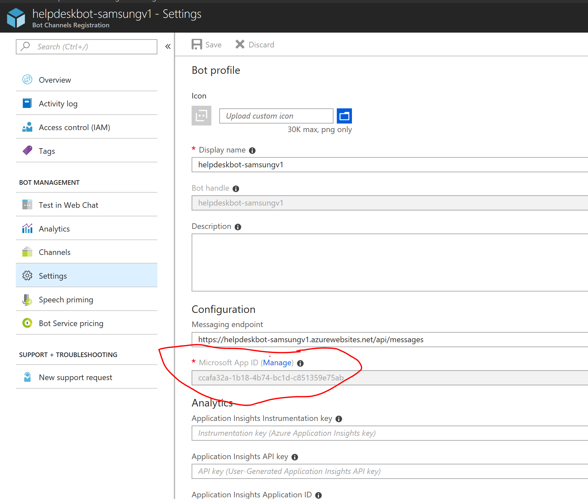
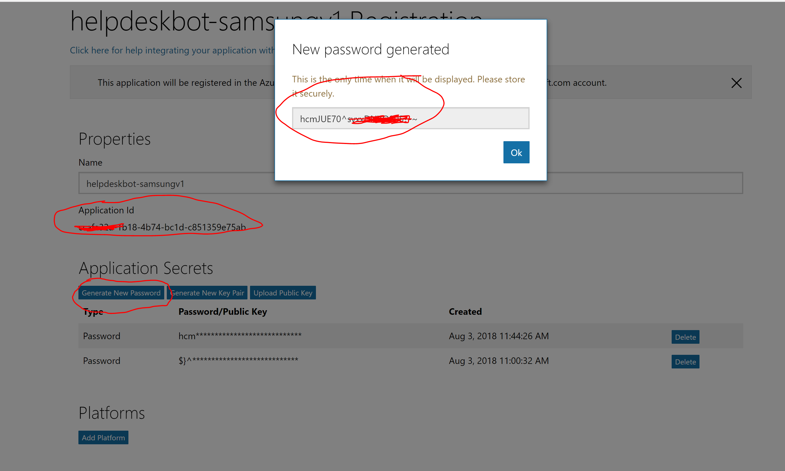
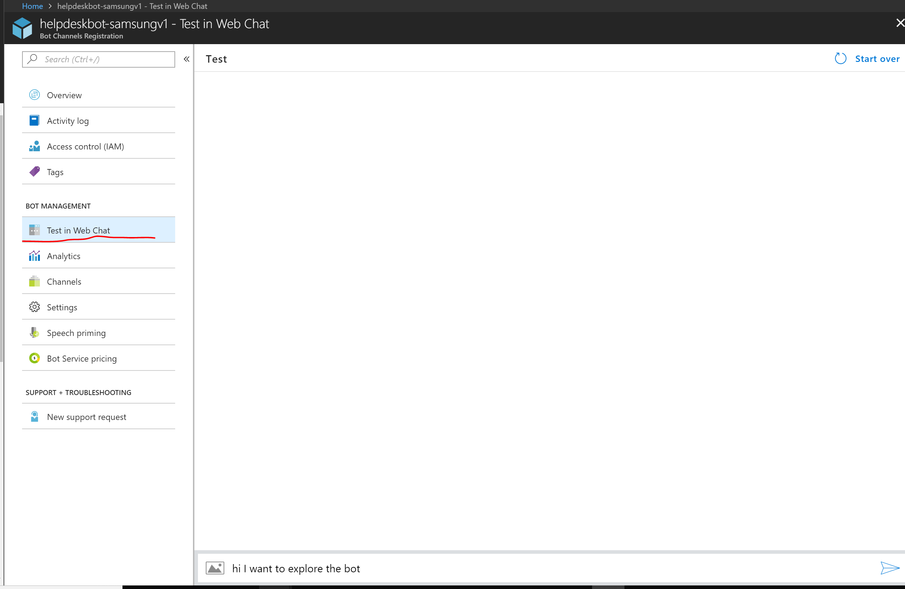

# Exercise 5: Deploying Your Bot to the Cloud (Node.js)

## Introduction

In this exercise you will learn how to register your bot and deploy it to Azure so others can use it.

## Prerequisites

The following software is required for completing this exercise:

* A code editor like [Visual Studio Code](https://code.visualstudio.com/download) (preferred), or Visual Studio 2017 Community or higher
* An [Azure](https://azureinfo.microsoft.com/us-freetrial.html?cr_cc=200744395&wt.mc_id=usdx_evan_events_reg_dev_0_iottour_0_0) subscription
* An account in the [LUIS Portal](https://www.luis.ai)
* [Git command line interface](https://git-scm.com/downloads)
* An [Skype](https://www.skype.com/) account (optional)

## Task 1: Register the Bot with the Bot Framework

In this task you will generate an _App ID_ and _App Password_, and register your bot.

1. In the Azure Portal Click on + Create new resource and Search for "Bot Channels Registration". Click "Create"


2. Fill the form. 

Provide a public display name of your Bot (you can change it later).

Select the Pricing Tier as F0. You can set the messaging point as "https://helpdeskbot-samsungv1.azurewebsites.net/api/messages" (You can change it later).

Turn off the Application Insights and Let the AppId and Password stay as "Auto create AppId and Password".

 

 3. Retrieve the AppID and Password.

 Go to the newly created Bot Channel Registration resource and click on Settings. Click on Microsoft AppId (Manage) Link

 


This will open a new page, which will show your appname and its id. Click on "Generate new password" under Application Secrets". Copy and keep the generated password with you. This password can be seen only once, you can regenerate passwords later as well.

 

## Task 2: Create an Azure Web App

In this task you will learn how to deploy and configure your app to enable it to communicate with the Bot framework channels.

1. Sign in to the [Azure portal](https://portal.azure.com). Click on the **New** button on the left bar, next click on the **Web + Mobile** and then choose **Web App**.

1. Enter an **App name**, choose a **Subscription** and a **Resource Group**. You can use the same resource group you've used for the Cosmos DB and Search services. Click **Create**.

    

1. Open the previously created _App Service_ if you are not there already. Click on **Application Settings** on the left menu. Navigate to the *App settings* and add the following keys and replace with the values described (you should have these values in your bot source code).

    Key | Description |
    ----|-------------|
    AZURE\_SEARCH\_ACCOUNT | Use the **Azure Search account name** |
    AZURE\_SEARCH\_INDEX | Use the **Azure Search index name** |
    AZURE\_SEARCH\_KEY | Use the **Azure Search key** |
    MICROSOFT\_APP\_ID | Use the **Bot App ID** |
    MICROSOFT\_APP\_PASSWORD | Use the **Bot Password** |
    LUIS\_MODEL\_URL | Use the **LUIS model URL** |
    TICKET\_SUBMISSION\_URL | Use your App Service URL (eg. https://help-desk-bot.azurewebsites.net/) |

    After you entered the key and values you should have a similar result as the image below.

    

1. Click **Save** ().

1. Navigate to the **Deployment** section and click on the **Deployment credentials** on the left bar. Type a **Username** and **Password** and confirm the password entered again on **Confirm Password**. Next click on the **Save** button.

    

1. Navigate to the **Deployment** section and click on the **Deployment options** on the left menu. Next click on the **Configure required settings** and then click on the **Local Git Repository**. Click **OK**.

    

1. Click on the **Overview** option on the left bar. Save for later use the **Git clone url** on the right column of the Essentials pane.

    

## Task 3: Publish your Bot to Azure

In this task you will publish your code to Git Repository and this will deploy your recent changes to the Azure App Service. For more information about Git you can check the Git Reference [here](https://git-scm.com/docs).

1. Open a console on the app folder you've obtained from the previous exercise. Alternatively, you can use the app from the [exercise4-KnowledgeBase](./exercise4-KnowledgeBase) folder. If you didn't create a Git repository for this code, type the following command in the console (if you already initialized this code to a Git repository, you don't need to do this step):

    ```
    git init
    ```

1. Next, type the following command and remember to replace the `{gitcloneurl}` with the **Git clone url** you obtained in the previous task.

    ```
    git remote add azure {gitcloneurl}
    ```

1. Type the following commands to commit you changes and push it to the _Azure web app_.

    ```
    git add .
    git rm --cached node_modules -r
    git commit -m "initial commit"
    git push azure master
    ```

1. Enter your deployment credentials you created on the previous task.

1. Next you should see files being uploaded, the npm packages installed on the remote server and finally the deployment status.

    

## Task 4: Update Your Bot Configuration

1. Navigate to the Azure Boot channel Registration Resource. 

1. Click on the **Settings** button on the left hand side Menu under **Bot Management**

1. On the _Configuration_ section, type the _Messaging endpoint_ you created on Task 2 (eg. https://help-desk-bot.azurewebsites.net/api/messages). Remember to put the `/api/messages` at the end of the URL and ensure the protocol is **https**. Click the **Save changes** button at the bottom of the page.

    

## Task 5: Test Your Published Bot

In this task you will test your bot from other channels.

1. Navigate to Azure Bot Channel Registration Resource.

1. Click on the **Test in Web Chat** button on the Left hand side **BOT MANAGEMENT** Menu. It should open a new window on the right of the page. This is an embedded _Web Chat Channel_ so you can easily test your bot.

1. Type `Hi! I want to explore the knowledge base` and see the bot response with the category list. 

    

1. Click the **Channels** menu item. Note you should have the **Skype** and **Web Chat** channels enabled by default. Click on the **Skype** link. A new page will open to allow to add your bot to your **Skype** account. Click on the **Add to Contacts** button. You should be prompted to be sign into your Skype Account and the Skype app should be opened.

    

    > **NOTE:** You can also check the **Get bot embed codes** link that shows you how to build a link for users to add the bot to their Skype account.

1. Search for the bot on your Contact List and test a new conversation.

    

    > **NOTE:** At the moment this hands-on lab was written Skype does not fully support Adaptive Cards, so you might not see the ticket confirmation message correctly.

## Further Challenges

* Test the bot from the Bot Emulator - you need to use [ngrok](https://docs.microsoft.com/en-us/bot-framework/debug-bots-emulator#a-idngroka-install-and-configure-ngrok) to let the bot know how to reply to your local computer.
* [Run code locally](https://blogs.msdn.microsoft.com/jamiedalton/2016/07/29/ms-bot-framework-ngrok/) while testing the bot via Skype or Web Chat.
* You can try adding [Bot Analytics by using Application Insights](https://docs.microsoft.com/en-us/bot-framework/portal-analytics-overview).
* Register the bot with another channel, such as [Slack](https://slack.com/).
